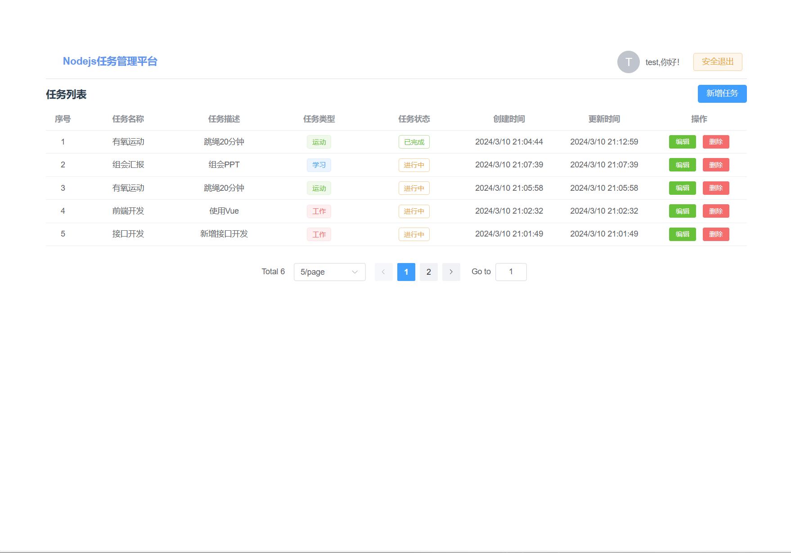
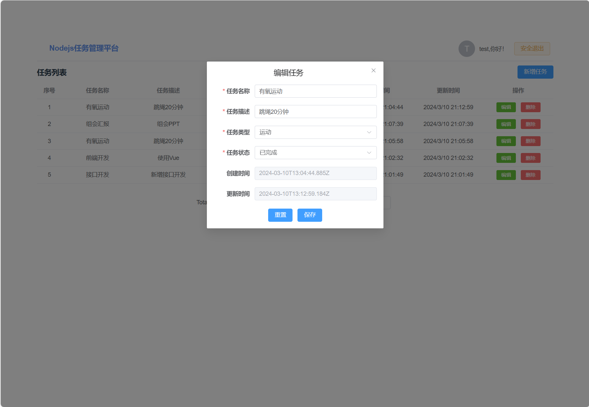
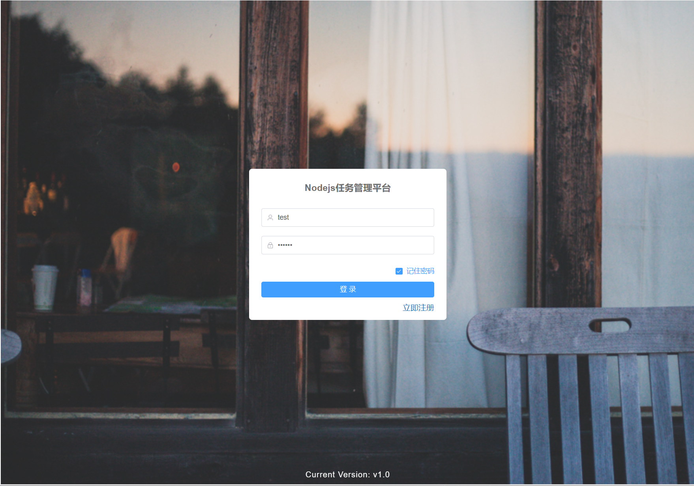

# Nodejs任务管理平台

这是一个前后端分离的任务管理系统，
前端使用Vue.js构建，后端基于Node.js和Express，数据存储使用MongoDB。

## 前端仓库
前端项目的源代码托管在GitHub上，您可以通过以下链接访问前端仓库：
[前端项目仓库](https://github.com/MJ-young/vue-demo)

## 功能特点

- **任务管理**：用户可以创建、编辑、删除和查询任务。
- **任务分类**：支持按任务类型和状态进行分类查看。
- **用户认证**：支持用户注册、登录，并通过JWT进行身份验证。
- **响应式设计**：界面支持多种设备，无论是桌面还是移动端均有良好体验。

## 技术栈

- **前端**：Vue.js, Vuex, Vue Router, Axios, Element Plus
- **后端**：Node.js, Express, Mongoose, JWT
- **数据库**：MongoDB

## 界面展示




！[注册](./screenshots/register.png)

## 登录用户

- 账号：test
- 密码：123456

## 快速开始

### 前提条件

- 安装[Node.js](https://nodejs.org/en/) (v12.0及以上版本)
- 安装[MongoDB](https://www.mongodb.com/try/download/community)

### 安装与运行

```bash

# 克隆项目
前端项目：git clone https://github.com/MJ-young/vue-demo.git
后端项目：git clone https://github.com/MJ-young/node-demo.git

# 前端项目
npm install
npm run serve

# 后端项目
npm install
npm start